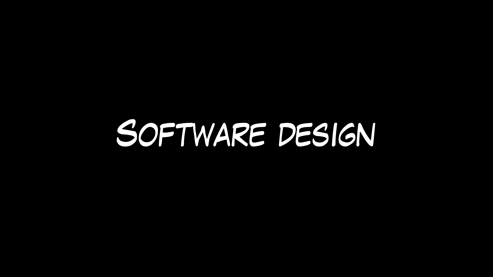

# Event Storming Tech Talk

Slides are taken from 
- [50000 Orange Stickies Later](https://de.slideshare.net/ziobrando/50000-orange-stickies-later) by Alberto Brandolini ([video](https://www.youtube.com/watch?v=1i6QYvYhlYQ))
- [Know the Flow](https://speakerdeck.com/martinschimak/ddd-exchange-london-2018-know-the-flow-events-commands-and-long-running-services) by Martin Schimak ([video](https://skillsmatter.com/skillscasts/11518-know-the-flow-events-commands-and-long-running-services))

## What is Event Storming tl;dr

- Fast and low overhead method for collaboratively discovering a business domain and enabling decision making, like
  - Identify core domain: Buy or make? 
  - Bottlenecks and pain points? Manual workarounds possible?
  - Context boundaries?
  - Building blocks?
- Individuals and interactions over processes and tools
  - enable conversations
  - empower people
  - create a shared mental model
- (Domain) Event + (Brain) Storming

## Motivation 

- Understand the problem domain
- "Is the problem they want solved the problem that needs to be solved?"
- "If only we had asked Bob..."
- Scrum doesn't help

### Rashomon effect

- One crime, four versions of the truth
- Avoid being the detective: let all stakeholders figure out the truth collaboratively

## Big Picture Event Storming

### Finding the truth collaboratively (what happened?)
   

### Outcome allows decision making

Blockers, bottlenecks, pain points

Context boundaries

### Each discarded post-it represents a conversation or an act of learning

### Example: Finding context boundaries (Domain "Organizing a meet-up")

Indicators
- cluster on timeline
- triggered by potentially a single command
- ends potentially with a single event
- language different from other clusters
- different stakeholders

Read a [summary of the workshop](https://medium.com/jugthde/domain-driven-design-renaissance-event-storming-a193db8ef887)

## Other Scopes

### Big Picture for complex environments

- low zoom events, birds eye view 
- emerging model
- defer consensus
- identify probing opportunities

We need variations for less complex scenarios

## Process Modelling

### Example: Order process

A trivial example of process modelling, showing three different flows of order fulfillment: FFC 2.0, FFC 1.0, DHL

## Software Design

    

### Example: Change email address

Read model: Form with input fields for new email address and confirmation
Command: Create change email request

Aggregate: Change email request
- New email is available? 
- New email is valid?
- Confirmation matches?
- Is a change email process already active?

Event: Started change email request, create token with limited lifetime
or Event: Resume change email request, reset token lifetime
Policy: Whenever the change email request has been started or resumed
Command: Create email to old email address with activation link
Event: Mail sent

Policy (manual): Mail received by user
Read model: mail
Command: User clicks link in mail

Aggregate: Change email request
Event: Token is valid
Read model: User can set a new password
Command: set new password
Event: Password reset
Read model: Password reset successfully

Policy: Whenever an email address is reset, send confirmation mail
or Event: Token is invalid or expired
Read model: Password reset form with error message

### Translate model easily to CQRS architecture

## Summary - different formats for different zoom levels

