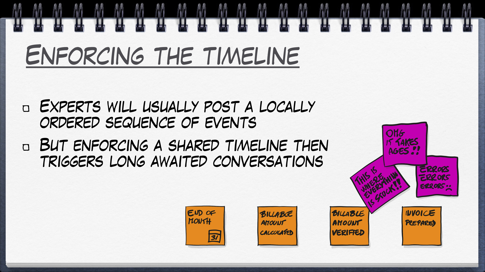
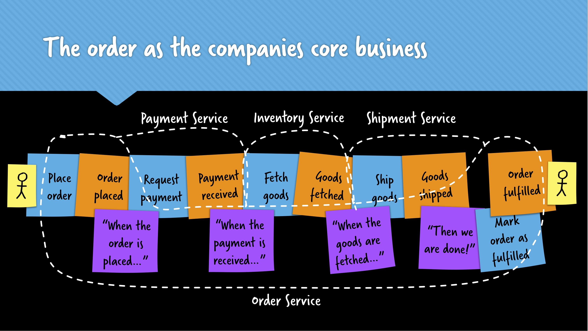

# Event Storming Tech Talk

## Why Event Storming

Taken from "50000 Orange Stickies Later", by Alberto Brandolini. [Slides](https://de.slideshare.net/ziobrando/50000-orange-stickies-later) and [talk](https://www.youtube.com/watch?v=1i6QYvYhlYQ). 

## Scopes

## Big Picture

### Value

- Big Picture
- Interactions and conversations
- Learning the business domain
- Decision enabler, Buy or make? Manual workarounds possible?

Cynefin: Complex
- Allow redundancy
- Emergent model
- Throw Away The Model

### Example: Organizing a meet-up

Read a [summary of the workshop](https://medium.com/jugthde/domain-driven-design-renaissance-event-storming-a193db8ef887)

## Process Modelling

### Example: Order process

Taken from [Martin Schimak's talk on process modelling](https://skillsmatter.com/skillscasts/11518-know-the-flow-events-commands-and-long-running-services). Take a look at his [slides](https://speakerdeck.com/martinschimak/ddd-exchange-london-2018-know-the-flow-events-commands-and-long-running-services) for more details.

## Software Design

### Example: Change email address

Read model: Form with input fields for new email address and confirmation
Command: Create change email request

Aggregate: Change email request
- New email is available? 
- New email is valid?
- Confirmation matches?
- Is a change email process already active?

Event: Started change email request, create token with limited lifetime
or Event: Resume change email request, reset token lifetime
Policy: Whenever the change email request has been started or resumed
Command: Create email to old email address with activation link
Event: Mail sent

Policy (manual): Mail received by user
Read model: mail
Command: User clicks link in mail

Aggregate: Change email request
Event: Token is valid
Read model: User can set a new password
Command: set new password
Event: Password reset
Read model: Password reset successfully

Policy: Whenever an email address is reset, send confirmation mail
or Event: Token is invalid or expired
Read model: Password reset form with error message

## Difference to other methods

### User Story mapping

### ...

## Links (refine later)

- 
- [Google Group](https://plus.google.com/communities/113258571348605620818)
- [Alberto Brandolini's blog](http://ziobrando.blogspot.com/search/label/EventStorming)
- Article in [JAXenter](https://jaxenter.de/ddd-event-storming-50285)

